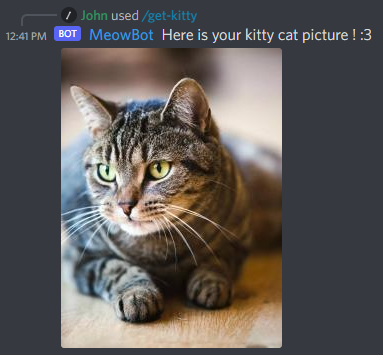

# Overview
Just a funny discord bot with some cat's commands !

# Install the project
Install nodejs and run `npm i` to install the required modules.

To provide the environment variables, just make a copy of the .env.template file and name it .env. Then you can complete it with your values.

**DISCORD_APP_ID**: The discord application id
 **DISCORD_BOT_TOKEN**: The discord bot token

# Start the bot
Create a bot on Discord and invite it on your server with the appropriate permissions. The bot need to have the permissions to read and write on the channel. It also works on private message directly with the bot.

To start the application just run `node src/index.js`

# Bot usage

### meow
If you use the `/meow`, the bot will answer your call !

### get-kitty
`/get-kitty` will make the bot to send you a random cat picture.

